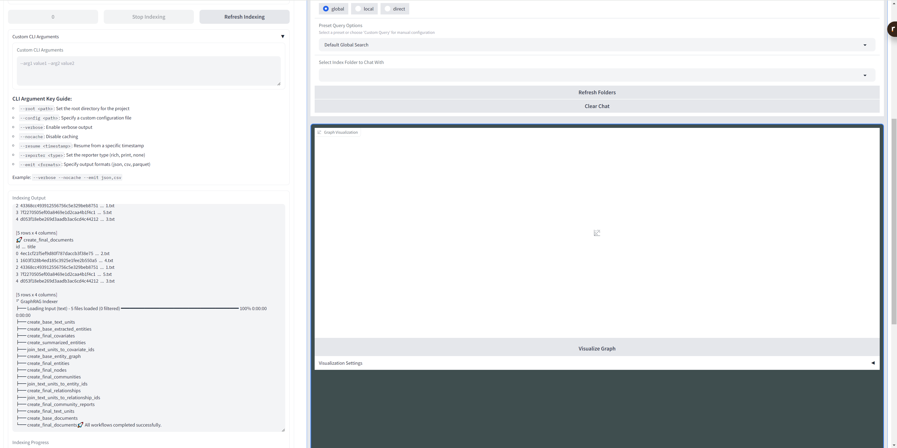
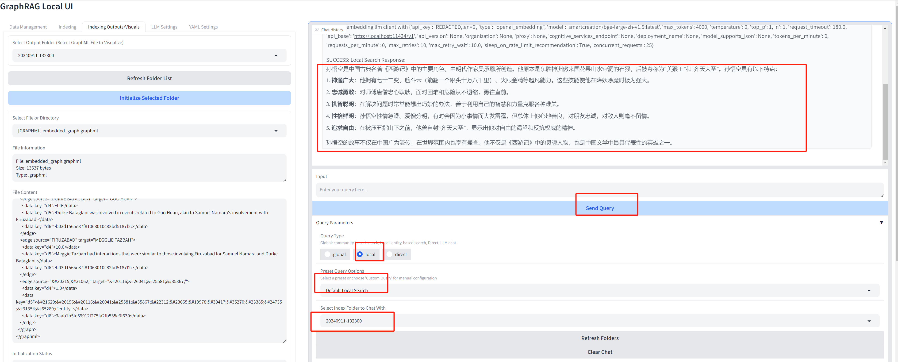

English | [简体中文](./README-CN.md)

# GraphRAG-UI

GraphRAG-UI is a user-friendly interface for [GraphRAG](https://github.com/microsoft/graphrag), a powerful tool that uses the Retrieval-Augmented Generation (RAG) approach to index and query large text data. This project supports the latest version graphrag-0.3.2 and aims to provide a convenient management and interaction method for GraphRAG, supporting the configuration of local large language models like Ollama, making it easier for users to leverage.

## Acknowledgments

This project is currently an upgrade based on the work of [severian42](https://github.com/severian42) and his [GraphRAG-Local-UI](https://github.com/severian42/GraphRAG-Local-UI) project. I would like to express my sincere gratitude to him for laying a solid foundation for this project. New features may be added in the future.

## Features

- **Intuitive Web Interface**: GraphRAG-UI provides a user-friendly web interface for easy configuration and use of GraphRAG.
- **Index Management**: Quickly create, update, and manage your text data indexes.
- **Query Execution**: Submit natural language queries and retrieve relevant content from indexed data, followed by responses from a large language model.
- **Configuration Options**: Customize various settings and parameters to fine-tune the indexing and querying processes.
- **Logging and Monitoring**: Monitor the progress of indexing and querying tasks through detailed logs and status updates.

## Sample screenshots:
### Indexing



### Visualize Graph (GIF image)


### Chat With GraphRAG



## Usage with pip

1. Install Ollama (optional):

    Visit the [Ollama website](https://ollama.com/) to install. If you're on Linux, you can run the following command directly:

    ```bash
    curl -fsSL https://ollama.com/install.sh | sh
    ```

2. Install this software via pip:

    ```bash
    pip install graphrag-ui
    or
    pip install graphrag-ui -i https://pypi.org/simple
    ```

3. Start the API Server

    ```bash
    graphrag-ui-server
    ```

4. Start the UI

    Start the comprehensive UI

    ```bash
    graphrag-ui
    ```

    Or start the pure UI

    ```bash 
    graphrag-ui-pure
    ```

## Source code installation and usage

1. Create and activate a new conda environment:
    ```bash
    conda create -n graphrag-ui -y
    conda activate graphrag-ui
    ```
2. Install Ollama（optional）:

    Visit [Ollama's website](https://ollama.com/) for installation instructions.
    
    Or Linux, run:

   ```bash
   curl -fsSL https://ollama.com/install.sh | sh
   ```

3. Clone the repository:
   ```bash
   git clone https://github.com/wade1010/graphrag-ui.git
   ```

4. Install the required packages:
    ```bash
    cd graphrag-ui
    pip install -r requirements.txt
    ```

5. Start the API server:
    ```bash
    python api.py --host 0.0.0.0 --port 8012 --reload
    ```

6. Start the UI:
    - **Clean version**

        This version only supports indexing, Prompt Tuning, and file management, without query functionality.
        ```bash
        gradio index_app.py
        or
        python index_app.py
        ```
    - **Comprehensive version**

        This version adds visualizations, configuration management, and GraphRAG chat functionality on top of the clean version.
        ```bash
        python app.py
        ```

7. Access the UI:
    - **Clean version**: `http://localhost:7860`
    - **Comprehensive version**: `http://localhost:7862`